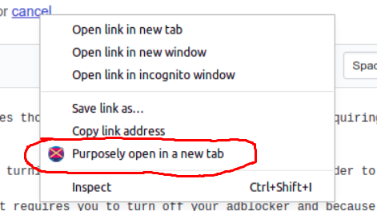

# ad-tab-closer
A chrome extension that automatically closes those pesky tabs and windows opened by ad-requiring sites

## Usage
1. Add the extension to chrome. Do this by turning on developer mode and dragging the folder to the chrome extensions screen. The extension should now be activated.
2. If any site is bothering you, meaning it requires you to turn off your adblocker and because you obeyed, it took it upon itself to randomly open tabs or windows containing ads, just click on the extension's icon and click 'Add URL'. That's all. 

The URL will now be added to chrome's local storage and the extension will begin monitoring any tab or window opened by that site, automatically closing faulty ones if needed.

## Notes
1. After adding a URL, all new tabs opened that start with the protocol+hostname of the URL will be allowed; all others won't.
This means that if https://www.adopeningsite.com is added, then all sites starting with https://www.adopeningsite.com like https://www.adopeningsite.com/clickads or https://www.adopeningsite.com/hoverads will be allowed to open in a new tab. The others will be automatically closed.

2. To _purposely_ open a new tab that has protocol+hostname different from that of the URL, right click the link and choose "Purposely open in a new tab". See the picture below. 

## Reference
Extension icon gotten freely from [Flaticon](https://www.flaticon.com/)

